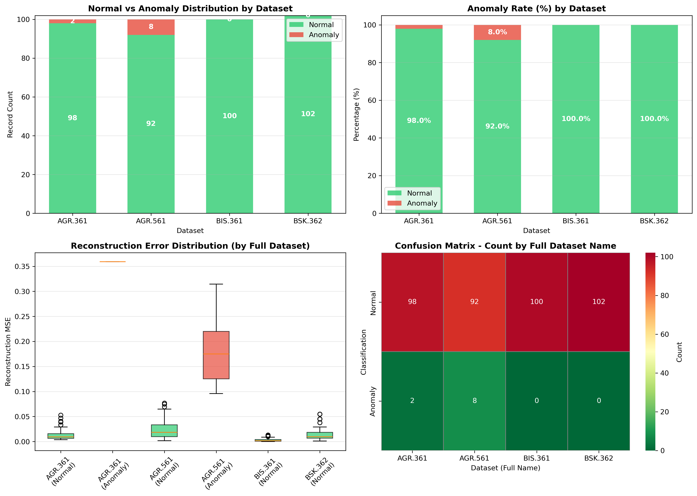
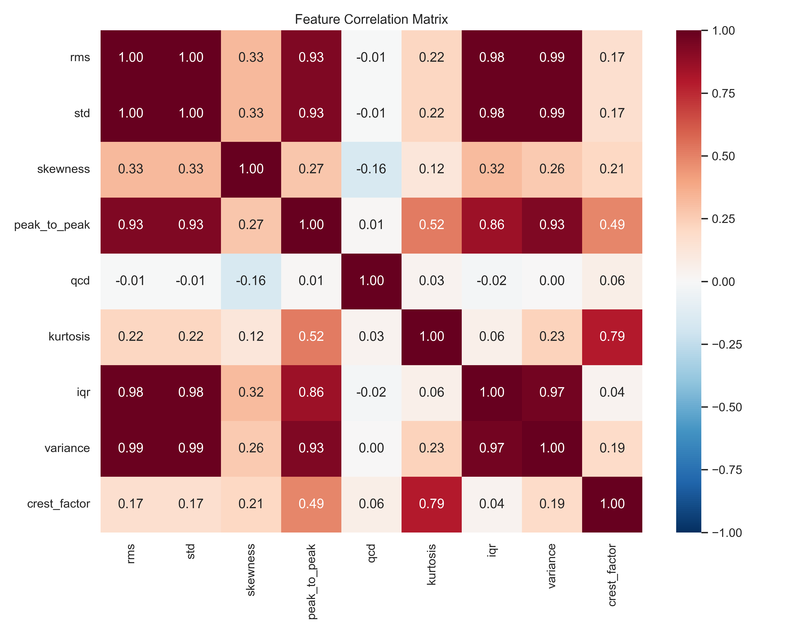
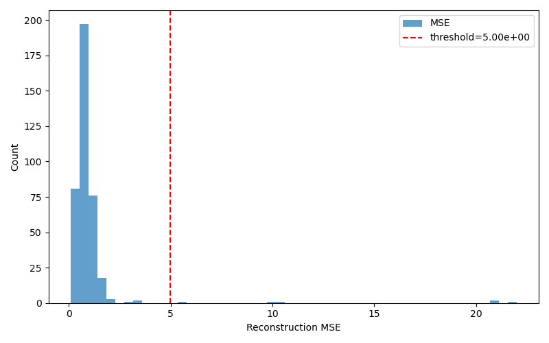
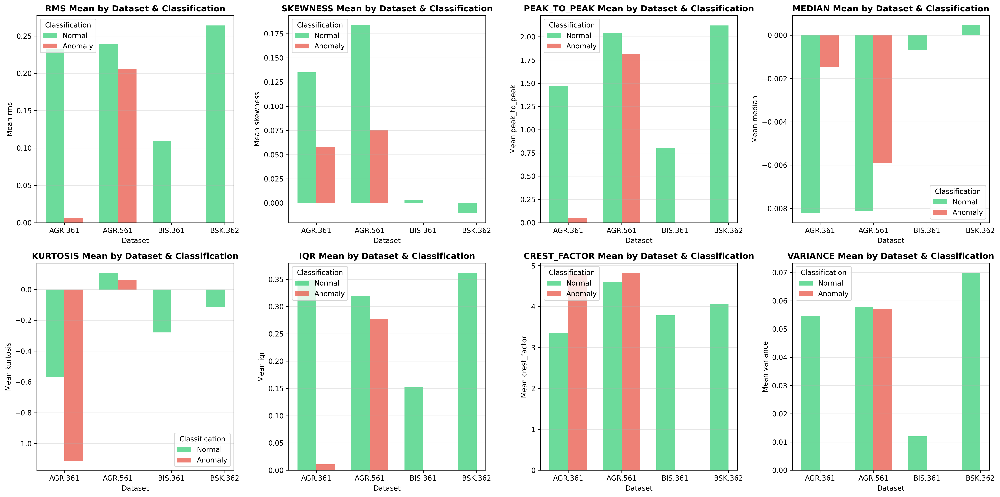
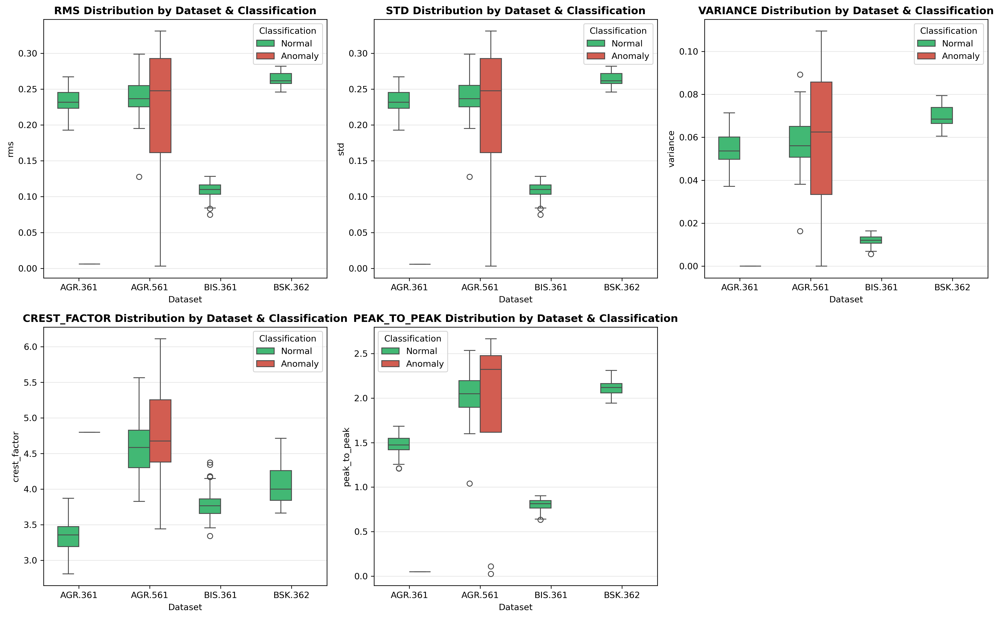

# 🔍 Anomaly Detection in Motor/Gearbox Systems

[](https://www.python.org/)
[](LICENSE)
[](https://github.com/sawan13/Anomaly-Detection/graphs/commit-activity)

An advanced machine learning project for detecting anomalies in motor and gearbox systems using autoencoder neural networks. This system identifies bearing looseness, gear grinding, shaft abnormalities, and other mechanical faults through vibration sensor data analysis.

## 📋 Table of Contents

- [Features](#features)
- [Dataset](#dataset)
- [Installation](#installation)
- [Usage](#usage)
- [Project Structure](#project-structure)
- [Scripts Overview](#scripts-overview)
- [Results & Visualizations](#results--visualizations)
- [Methodology](#methodology)
- [Contributing](#contributing)
- [License](#license)

## ✨ Features

- **Autoencoder-based Anomaly Detection**: Uses unsupervised learning to identify mechanical faults
- **Time Domain Feature Extraction**: RMS, skewness, kurtosis, crest factor, and more
- **Multi-dataset Analysis**: Supports AGR.361, AGR.561, BIS.361, and BSK.362 datasets
- **Comprehensive Visualization**: Bar plots, box plots, correlation matrices, and reconstruction error histograms
- **Modular Architecture**: Separate scripts for data processing, training, and analysis
- **Performance Metrics**: Reconstruction error analysis and anomaly classification

## 📊 Dataset

The project analyzes vibration sensor data from four different motor/gearbox configurations:

- **AGR.361**: Agricultural machinery dataset
- **AGR.561**: Agricultural machinery dataset (different configuration)
- **BIS.361**: Industrial machinery dataset
- **BSK.362**: Bearing system dataset

### Data Structure
- **Raw Data**: JSON files containing high-frequency sensor readings
- **Features**: 25+ time-domain and frequency-domain features extracted per signal
- **Labels**: Normal vs. anomaly classification based on reconstruction error thresholds

## 🚀 Installation

### Prerequisites
- Python 3.8 or higher
- pip package manager

### Setup Steps

1. **Clone the repository**
   ```bash
   git clone https://github.com/sawan13/Anomaly-Detection.git
   cd Anomaly-Detection
   ```

2. **Create virtual environment**
   ```bash
   python -m venv .venv
   # Windows
   .venv\Scripts\activate
   # Linux/Mac
   source .venv/bin/activate
   ```

3. **Install dependencies**
   ```bash
   pip install -r reports/requirements.txt
   ```

## 📖 Usage

### Quick Start

1. **Extract and prepare data**
   ```bash
   # Run exploratory data analysis
   python scripts/eda.py
   ```

2. **Train autoencoder model**
   ```bash
   # Train on selected features
   python scripts/train_autoencoder_selected.py
   ```

3. **Analyze results**
   ```bash
   # Generate visualizations
   python scripts/generate_requested_plots.py
   ```

### Complete Workflow

```bash
# 1. Extract features from raw sensor data
python scripts/feature_analysis.py

# 2. Prepare selected features for training
python scripts/prepare_selected_features.py

# 3. Train autoencoder
python scripts/train_autoencoder_selected.py

# 4. Analyze reconstruction results
python scripts/analyze_reconstruction_selected.py

# 5. Generate comparative visualizations
python scripts/boxplot_feature_comparison.py

# 6. Compare different visualization approaches
python scripts/compare_visualizations.py
```

## 📁 Project Structure

```
Anomaly-Detection/
├── data/                          # Raw sensor data (ZIP files)
│   ├── AGR.361+GB01-N01.zip
│   ├── AGR.561+GB01-N01.zip
│   ├── BIS.361+GB01-N01.zip
│   └── BSK.362+GB01-N01.zip
├── data/extracted/                # Extracted JSON sensor files
├── scripts/                       # Python analysis scripts
│   ├── eda.py                    # Exploratory data analysis
│   ├── feature_analysis.py       # Feature extraction
│   ├── prepare_selected_features.py
│   ├── train_autoencoder_selected.py
│   ├── analyze_reconstruction_selected.py
│   ├── boxplot_feature_comparison.py
│   ├── generate_requested_plots.py
│   └── compare_visualizations.py
├── results/                       # Analysis results (CSV files)
├── images/                        # Generated visualizations
├── models/                        # Trained models
├── reports/                       # Analysis reports and summaries
├── docs/                          # Documentation
└── README.md
```

## 🔧 Scripts Overview

| Script | Purpose | Key Outputs |
|--------|---------|-------------|
| `eda.py` | Initial data exploration | Data summaries, basic statistics |
| `feature_analysis.py` | Extract time/frequency features | `extracted_features.csv` |
| `prepare_selected_features.py` | Feature selection and preprocessing | `selected_features.csv` |
| `train_autoencoder_selected.py` | Train autoencoder model | `autoencoder_selected.joblib` |
| `analyze_reconstruction_selected.py` | Evaluate model performance | Reconstruction analysis |
| `boxplot_feature_comparison.py` | Generate comparative plots | Feature comparison visualizations |
| `generate_requested_plots.py` | Create publication-ready plots | PNG images in `/images` |
| `compare_visualizations.py` | Compare different analysis methods | Comparative reports |

## 📈 Results & Visualizations

### Anomaly Distribution by Dataset


### Feature Correlation Matrix


### Reconstruction Error Histogram


### Feature Comparison Across Datasets


### Box Plot Analysis


## 🎯 Methodology

### 1. Data Preprocessing
- Extract vibration signals from JSON files
- Apply time-domain feature extraction (RMS, skewness, kurtosis, etc.)
- Normalize and scale features for model training

### 2. Autoencoder Architecture
- **Encoder**: Compresses input features to lower-dimensional representation
- **Decoder**: Reconstructs original features from compressed representation
- **Loss Function**: Mean Squared Error (MSE) between input and reconstruction

### 3. Anomaly Detection
- **Threshold-based Classification**: Samples with reconstruction error > threshold = Anomalous
- **Threshold Selection**: Based on statistical analysis of normal data distribution

### 4. Feature Engineering
- **Selected Features**: RMS, standard deviation, skewness, peak-to-peak, kurtosis, IQR, variance, crest factor
- **Domain Knowledge**: Features chosen based on mechanical fault detection literature

## 🤝 Contributing

We welcome contributions! Please follow these steps:

1. Fork the repository
2. Create a feature branch (`git checkout -b feature/AmazingFeature`)
3. Commit your changes (`git commit -m 'Add some AmazingFeature'`)
4. Push to the branch (`git push origin feature/AmazingFeature`)
5. Open a Pull Request

### Development Guidelines
- Follow PEP 8 style guidelines
- Add docstrings to new functions
- Update README for significant changes
- Test scripts before committing

## 📄 License

This project is licensed under the MIT License - see the [LICENSE](LICENSE) file for details.

## 🙏 Acknowledgments

- Dataset provided by [Source Organization]
- Autoencoder implementation inspired by scikit-learn and TensorFlow documentation
- Visualization techniques adapted from matplotlib and seaborn best practices

## 📞 Contact

**Sawan Kumar Makwana**
- GitHub: [@sawan13](https://github.com/sawan13)
- Email: sawankumar.makwana@gmail.com
---

⭐ **Star this repository** if you find it helpful for your anomaly detection projects!
